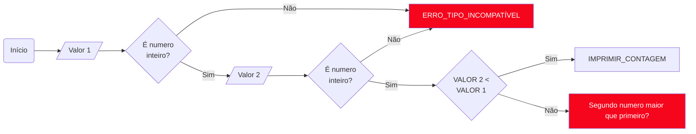

# DESAFIO CONTROLE FLUXO

Nessa desafio proposto pela [DIO](https://github.com/digitalinnovationone) (github) tive a missão de fazer um controle de fluxo aonde o sistema deve contar de 1 até o total inputado pelo usuário. 
O usuário terá que preencher dois valores e quando o último valor for preenchido o sistema calculara a diferênça do primeiro valor para o segundo, sendo essa diferênça o total da contagem.

## Fluxo



## Requisitos


1. Se o primeiro número for maior que o segundo, o sistema deve lançar uma exceção customizada chamada ```ParametrosInvalidosException``` com a mensagem: "O segundo parâmetro deve ser maior que o primeiro".
2. Se o primeiro número for menor ou igual ao segundo, o sistema deve imprimir no console os números incrementados, começando do primeiro parâmetro até o segundo parâmetro.


## Como Executar
1. Clone este repositório para a sua máquina local.
2. Abra o terminal na pasta do projeto.
3. Compile as classes Java:
```sh
javac Contador.java ParametrosInvalidosException.java
```
4. Execute o programa:
```sh
java Contador
```
5. Insira os dois parâmetros quando solicitado e observe o resultado.

## Exemplo de Uso

### Exemplo 1: Primeiro parâmetro menor que o segundo
```sh
Digite o primeiro parâmetro
12
Digite o segundo parâmetro
30
```
Saída:
```sh
Imprimindo o número 1
Imprimindo o número 2
Imprimindo o número 3
...
Imprimindo o número 18
```
### Exemplo 2: Primeiro parâmetro maior que o segundo

```sh
Digite o primeiro parâmetro
30
Digite o segundo parâmetro
12
```
Saída:
```sh
O segundo parâmetro deve ser maior que o primeiro
``` 

### Exemplo 3: Inputar dentro de valores algo que não seja um numero interio
```sh
Digite o primeiro parâmetro
a
```
Saída:
```sh
São permitidos apenas numeros interioros
```

